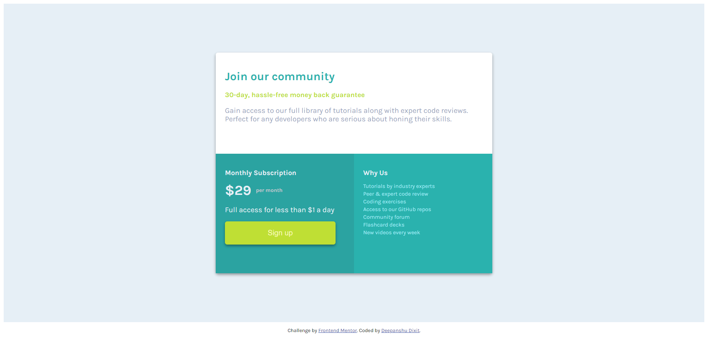
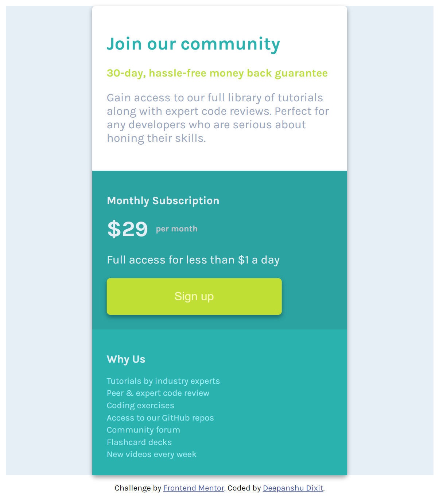

# Frontend Mentor | Single Price Grid Component

## Table of Contents
- [Overview](#overview)
  - [The challenge](#the-challenge)
  - [Screenshot](#screenshot)
  - [Links](#links)
- [My process](#my-process)
  - [Built with](#built-with)
  - [What I learned](#what-i-learned)
  - [Continued development](#continued-development)
  - [Useful resources](#useful-resources)
- [Author](#author)
- [Acknowledgments](#acknowledgments)

## Overview

### The challenge

Create a single price grid component that displays pricing plans and features in a visually appealing way.

### Screenshot

### Links

- Solution URL: [Add solution URL here](https://github.com/Deepanshu1337/single-price-grid-component-master)
- Live Site URL: [Add live site URL here](https://deepanshu1337.github.io/single-price-grid-component-master/)

## My process

### Built with

- Semantic HTML5 markup
- CSS custom properties
- Flexbox
- CSS Grid

### What I learned

Through this project, I enhanced my understanding of CSS Grid and Flexbox. I learned how to effectively use grid-template-rows and grid-template-columns to create complex layouts. Additionally, I gained experience with responsive design techniques, ensuring that the component looks great on both desktop and mobile devices.

### Continued development

I plan to continue improving my skills in CSS Grid and Flexbox. In future projects, I aim to explore more advanced CSS properties and techniques, such as CSS animations and transitions. Additionally, I want to deepen my knowledge of JavaScript to add more interactivity to my projects.

### Useful resources

- [MDN Web Docs - CSS Grid Layout](https://developer.mozilla.org/en-US/docs/Web/CSS/CSS_Grid_Layout) - This helped me understand the basics of CSS Grid.
- [CSS Tricks - A Complete Guide to Grid](https://css-tricks.com/snippets/css/complete-guide-grid/) - This is an amazing article which helped me finally understand how to use CSS Grid. I'd recommend it to anyone still learning this concept.

## Author

- LinkedIn - [Deepanshu Dixit](https://www.linkedin.com/in/deepanshudixit280/)

## Acknowledgments

I would like to thank Frontend Mentor for providing this challenge. Their platform is an excellent resource for developers to practice and improve their front-end skills.
